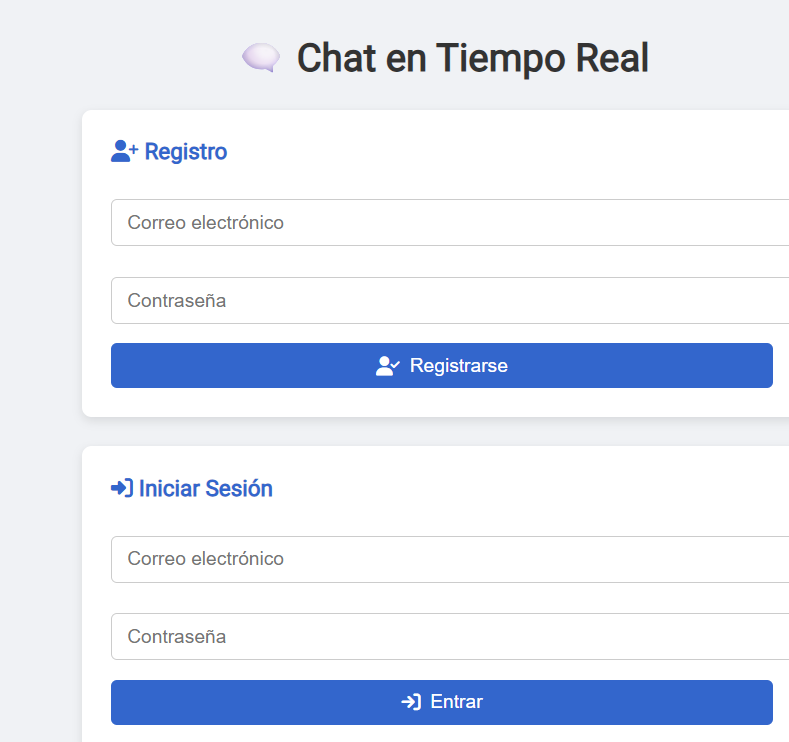
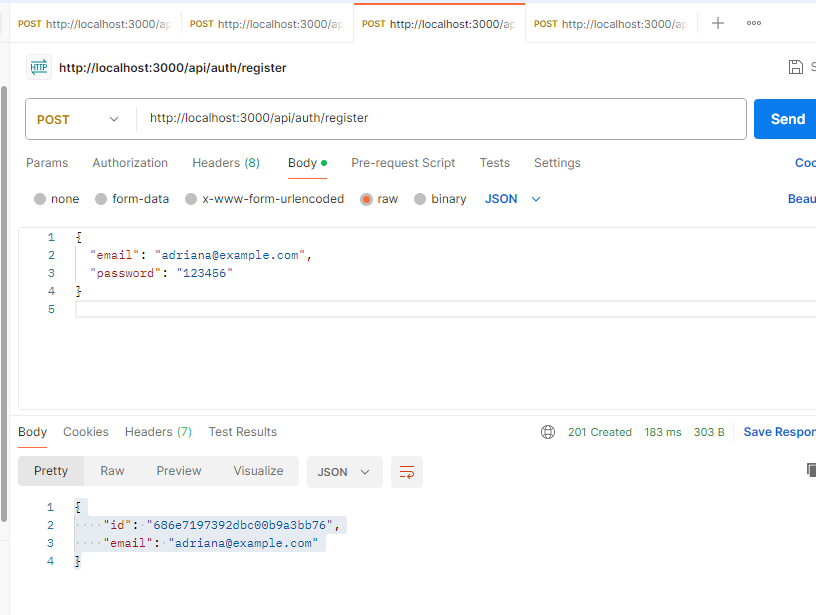
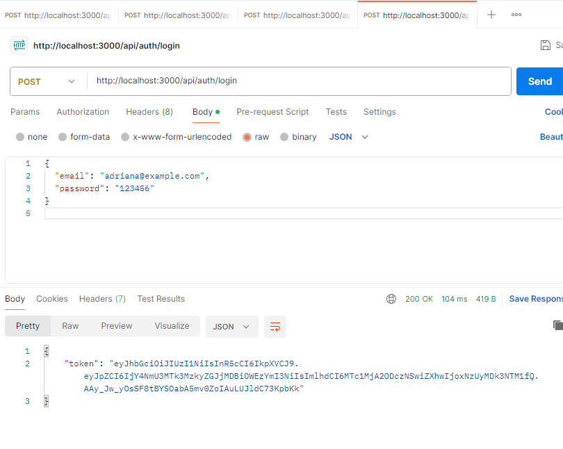
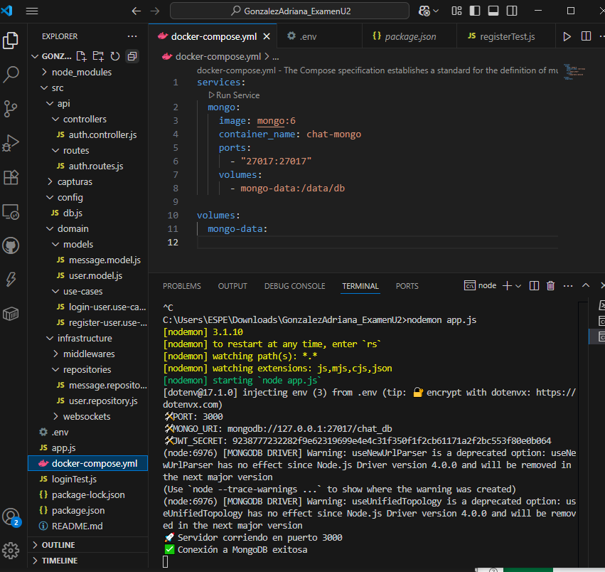

# 💬 Examen Unidad 2 - Backend de Chat en Tiempo Real

Este proyecto fue desarrollado como parte del Examen de la Unidad 2 de la materia **Aplicaciones Distribuidas**. Implementa un backend para un chat en tiempo real con autenticación, persistencia de mensajes y arquitectura limpia.

---

## 📸 Capturas del Proyecto

### 🖥️ Vista del Frontend (Formulario)

Muestra el formulario de registro e inicio de sesión en la interfaz del frontend.

---

### 🔐 Registro de Usuario

---

### 🔑 Inicio de Sesión

---

### 🐳 Docker en ejecución (MongoDB)

---

## 🧰 Tecnologías Usadas

- 🟢 **Node.js** + Express
- 🧱 **MongoDB** con Mongoose
- 🔐 **JWT** para autenticación
- 🔌 **Socket.IO** para comunicación en tiempo real
- 🧠 Arquitectura Limpia (Clean Architecture)
- 🐳 **Docker** para entorno de base de datos

---

## 📁 Estructura del Proyecto

/src  
├── api  
│ ├── controllers  
│ └── routes  
├── domain  
│ ├── models  
│ └── use-cases  
├── infrastructure  
│ ├── middlewares  
│ ├── repositories  
│ └── websockets  
├── config  
├── capturas  
├── app.js  
└── .env

yaml

---

## ⚙️ Configuración

### 1. Instala dependencias

npm install
2. Archivo .env
---
### env

PORT=3000  
MONGO_URI=mongodb://127.0.0.1:27017/chat_db  
JWT_SECRET=claveSuperSecreta123
---
### 3. Inicia MongoDB con Docker

docker compose up -d
---
### 4. Inicia el servidor

nodemon app.js
### 📦 Endpoints
### 📝 POST /api/auth/register
Crea un nuevo usuario.

{
  "email": "adriana@example.com",
  "password": "123456"
}
---
### 🔐 POST /api/auth/login
Devuelve un JWT para autenticación.

{
  "email": "adriana@example.com",
  "password": "123456"
}
---
### 📥 Respuesta esperada:

{
  "token": "eyJhbGciOiJIUzI1NiIsInR..."
}
---
### 🌐 WebSocket (Socket.IO)
Una vez autenticado, el usuario puede conectarse a WebSocket con su token:
---
### Conexión con autenticación

const socket = io("http://localhost:3000", {
  auth: {
    token: "JWT_TOKEN"
  }
});
Emitir mensaje

socket.emit("sendMessage", {
  text: "Hola mundo"
});
---
### ✅ Funcionalidades Completadas
Funcionalidad	Estado
Registro de usuario	✅
Inicio de sesión (JWT)	✅
Conexión WebSocket protegida	✅
Envío de mensajes en tiempo real	✅
Guardado de mensajes en MongoDB	✅
Uso de Docker para MongoDB	✅
---
### 👩‍💻 Desarrollado por
Adriana Pamela González Orellana
### 📧 apgonzalez1@espe.edu.ec
---
### d📘 Licencia
Este proyecto es parte de una evaluación académica. No distribuir sin autorización.